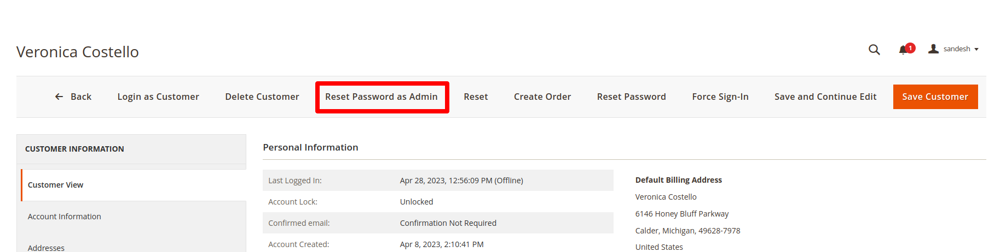

# customer-password-reset

Hello World,

I have created a new Magento 2 module to reset the password as Admin, As a developer we all have faced the pain of debugging any issue that is customer-centric and in order to reset his password, we need to prepare a SQL query or send the reset password email to the user’s email to reset the password.

This module helps in resetting the password directly from the customer edit form level instantly.

Follow the below steps to install and use the module

Install the module via composer
How to reset the password?
1. Install the module

   ```composer require sandesh/module-customer-password-reset```

    Run the above command in your Magento root directory and the module will be installed

2. How to reset the password?

   Go to the Customers listing in the Magento admin panel, then click on the customer whose password needs to be reset. You will see an option of Reset your Password as admin just like shown in the below image.

    

Clicking on reset password as admin a popup will be shown, just like shown in the below image, and that field has a certain set of validation, the password should be more than 8 digits and the password should consist of a combination of at least 1 Upper case, 1 lower case, 1 special character and 1 number without this validation the password won’t be updated.


After successfully matching the condition the password will be reset and an acknowledgment alert will be shown to the admin.


There is also an admin level restriction that can be set, where based on the admin user roles, you can enable and disable the reset password as admin feature, the resource name given for this functionality is ‘Sandesh_CustomerPasswordReset::reset_password_as_admin‘.

Also please star the repository if you have liked the module. Thanks!
